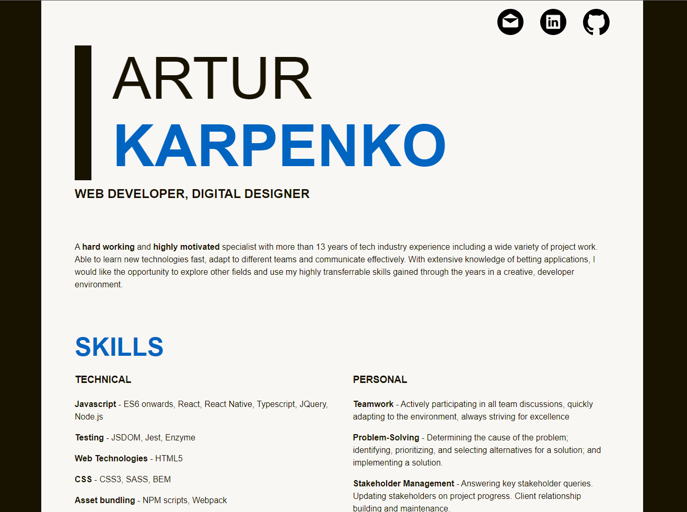

# CV - Artur Karpenko

 

This repository is an attempt to make CV both fun and useful. It is built using React with full testing and bundling integration.

For now CV is hosted on GitHub pages.

## Development

### Preview and bundling

To preview simply open `index.html`, but please ensure that `/assets` folder is refreshed. This can be done by running:

```
npm run bundle
```

**Please note:** `/assets` folder **must** be commited.

### Testing

Testing can be run by executing the following in the terminal of your choice:

```
npm run test
```

**Please note:** tests are used to both ensure that components function correctly and data is structure properly.

### Linting

To ensure code consistency linting was introduced. It uses AirBnb setup with minor modifications. To run linting please run the following:

```
npm run lint
```

## Mock-Up

The following image shows the web application's appearance and functionality:



## TODO

- fetch data rather than bundling it in and improve caching;
- split out Header component into multiple components;
- slit out Job component into multiple components;
- improve testing for Read more functionality;
- change testing to look at the full `data.json`;
- add Express server;
- add dev script with autorefresh;
- add server side rendering for appropriate parts;
- host in AWS;
- improve how styling is imported (potentially via `js` imports);
